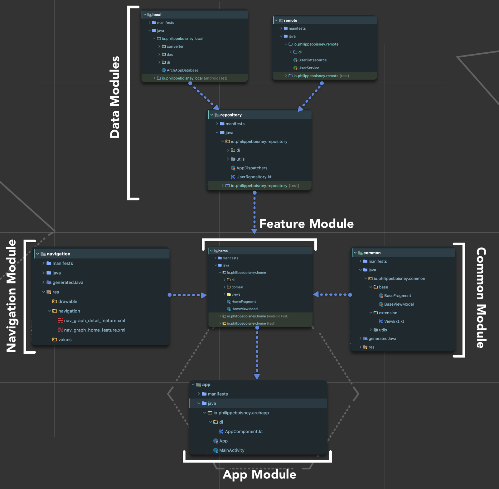

# Unidad Editorial

#### Requisitos

Para compilar el proyecto es necesario Android Studio 3.4 o superior

## Arquitectura de la Aplicación

Se ha optado por una arquitectura modular basado en MVVM que nos facilita la separación de todas las capas de dominio que establece Clean Architecture. Se utiliza Kotlin por su sencillez, por ser más robusto a errores y en general por su gran proyección (ya es el lenguaje oficial para el desarrollo en Android). Para la ejecución en segundo plano se ha optado por las corutinas de Kotlin por la facilidad y potencia que nos ofrece. Vamos a dar un repaso a los distintos módulos:

### App Module

Es el punto de entrada de la App. Contiene la Actividad que va a realizar la navegación entre las distintas features, el grafo de dependencias del inyector de dependencias (_Dagger_) y el icono de aplicación.

### Navigation Module

En este módulo se define la navegación de toda la aplicación con la librería de _Navigation Component_. Para ello se definen grafos de navegación para cada feature.

### Common Module

Este módulo contiene los archivos base (_BaseFragment_, _BaseViewModel_, etc) que utilizarán las _features_ además de utilidades comunes.

### Feature Module

Cada funcionalidad de la aplicación se organizará en distintos módulos de _Feature_. Aquí se encuentran los _Fragments_ con las vistas, los ViewModel y los casos de uso que acceden al repositorio. Las vistas se asocian mediante la librería de _DataBinding_ a los _ViewModel_ y reaccionan a los cambios de datos gracias a _LiveData_ con lo cual siempre tendremos la UI actualizada.

### Data Modules

Aquí tendremos las distintas fuentes de datos de la aplicación. El módulo más importante es el Repositorio, que se encarga de gestionar las peticiones entre las distintas fuentes de datos. En nuestro caso tenemos un módulo de datos local realizado con _Room_ que hace las veces de caché interna y otro módulo de datos remotos realizado con _Retrofit_ que se encarga de realizar la llamada a los distintos WebServices de la aplicación. El repositorio buscará primero en la caché y si encuentra datos y son recientes no realizará ninguna llamada a WebService.

## Librerías utilizadas

- __Dagger__: Para la inyección de dependencias. Recomendamos que en el proyecto final se use Koin ya que está más integrado con Kotlin y en su versión 2.0 ha mejorado su rendimiento y ya se encuentra a la altura de Dagger.
- __Retrofit__: Para las llamadas a WebServices.
- __Navigation Component__: Para gestionar la navegación de la aplicación.
- __ViewModel__: Para _controlar_ las vistas, parte fundamental de la arquitectura MVVM.
- __LiveData__: Para hacer las vistas reactivas a los cambios de datos y mantener siempre la UI actualizada, otra parte fundamental de MVVM.
- __Room__: Para la base de datos interna.
- __DataBinding__: Para separar aún más la lógica de dominio y la de vista, quedando ésta última casi completamente en el layout.
- __Corutinas__: Para la ejecución de código en segundo plano. Con Kotlin no hay nada mejor.